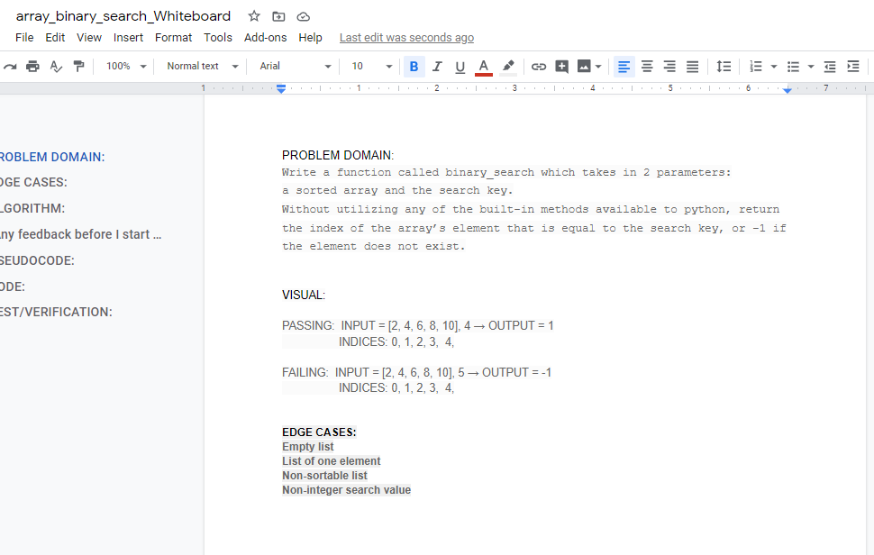
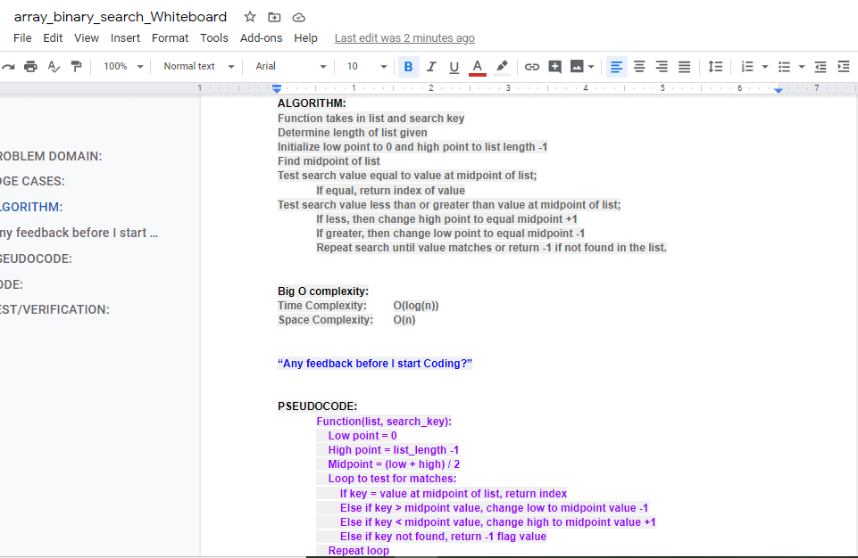

# Binary Search of an Array
Given a list and a value to be used as a search key, use a binary search methodology to determine whether the search key value exists in the array.

## Challenge Description
Write a function called BinarySearch (changed to "binary_search" to be pythonic) which takes in 2 parameters: a sorted array and the search key. Without utilizing any of the built-in methods available to your language, return the index of the array’s element that is equal to the search key, or -1 if the element does not exist.

## Approach & Efficiency
I decided upon an iterative approach to perform the binary search.  

Big O space for this approach is O(n)  
Big O time for this approach is O(log(n)  

## Solution

[My Code is here.](array_binary_search.py)

## Task Checklist:  
- [X] Top-level README “Table of Contents” is updated  
- [X] Feature tasks for this challenge are completed  
- [X] Unit tests written and passing  
    - [X] “Happy Path” - Expected outcome  
    - [X] Expected failure  
    - [X] Edge Case (if applicable/obvious)  
- [X] README for this challenge is complete  
    - [X] Summary, Description, Approach & Efficiency, Solution  
    - [X] Link to code  
    - [X] Pictures of whiteboard  

Pull Request submitted: https://github.com/vorSherer/Py-DSnA/pull/11

## Collaboration and Attribution
Thanks to __*Skyler Burger*__ for help with list comprehensions (*after* I brute-force created a list of 100000 elements!)  
[Big O Cheatsheet](https://www.bigocheatsheet.com/) helped in determining *Big O* for this assignment.  
