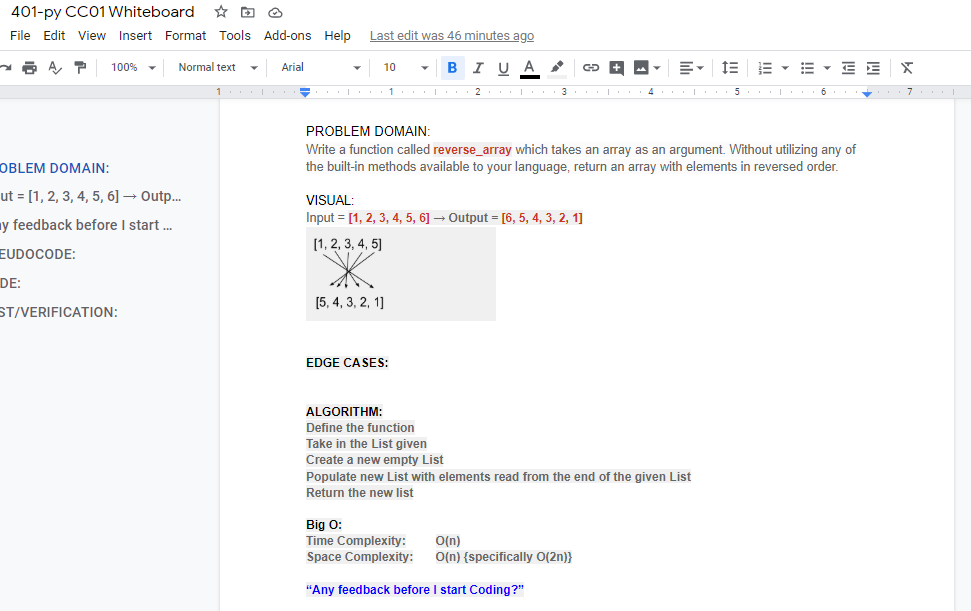
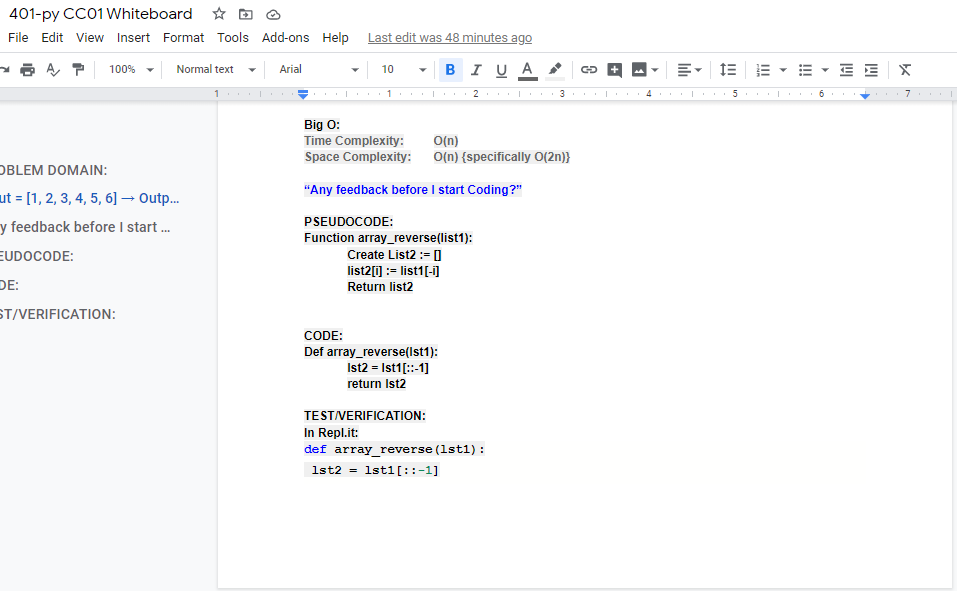

# Reverse an Array
Code challenge 1

## Challenge
Write a function called reverse_array which takes an array as an argument. Without utilizing any of the built-in methods available to your language, return an array with elements in reversed order.

## Approach & Efficiency
I used a slice approach with a -1 step to load a new array and returned the new array.
Big O = O(n)  
[My code is here](array_reverse.py)

## Solution

Checklist:

Specifications
- [X] All work done in a public repository called Py-DSnA (due to naming conflicts).
- [X] Create a new branch in your repo called array-reverse.
- [X] Top-level README contains a “Table of Contents” navigation to all of your challenges and implementations so far.
- [X] This assignment completed within the challenges subdirectory.
- [X] On your branch, create a folder named array_reverse which contains a file called array_reverse.py
Include any language-specific configuration files required for this challenge to become an individual component, module, library, etc.

Feature Tasks
- [X] Write a function called reverseArray which takes an array as an argument. Without utilizing any of the built-in methods available to your language, return an array with elements in reversed order.

Structure and Testing
- [X] Utilize the Single-responsibility principle: any methods you write should be clean, reusable, abstract component parts to the whole challenge.
- [X] There is no test requirement for Class01.

Documentation: Your README.md
- [X] TITLE: # Reverse an Array - Short summary or background information
- [X] ## Challenge - Description of the challenge
- [X] ## Approach & Efficiency - Describe chosen approach and what is the Big O space/time for this approach.
- [X] ## Solution - Embedded whiteboard image(s).
