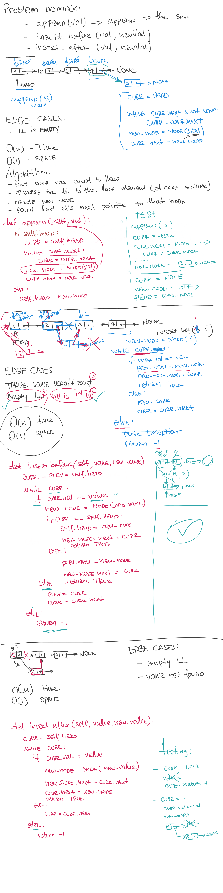
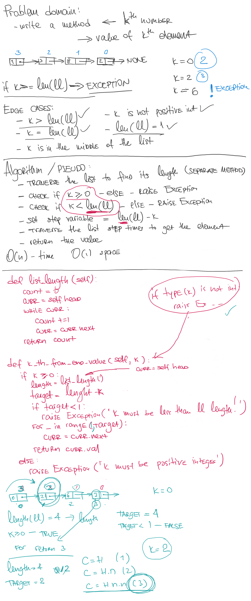

# Singly Linked List
This project demonstrates the instantiation and modification of a singly-linked list.

## Challenge 05
* Create a Node class that has properties for the value stored in the Node, and a pointer to the next Node.
* Within your LinkedList class, include a head property. Upon instantiation, an empty Linked List should be created.
* Define a method called insert which takes any value as an argument and adds a new node with that value to the head of the list with an O(1) Time performance.
* Define a method called includes which takes any value as an argument and returns a boolean result depending on whether that value exists as a Node’s value somewhere within the list.
* Define a method called \__str__ which takes in no arguments and returns a string representing all the values in the Linked List, formatted as:
"{ a } -> { b } -> { c } -> None"
* Any exceptions or errors that come from your code should be semantic, capturable errors. For example, rather than a default error thrown by python, your code should raise/throw a custom, semantic error that describes what went wrong in calling the methods you wrote for this lab.
* Be sure to follow your language/frameworks standard naming conventions (e.g. C# uses PascalCasing for all method and class names).

Write tests to prove the following functionality:  
1. Can successfully instantiate an empty linked list
1. Can properly insert into the linked list
1. The head property will properly point to the first node in the linked list
1. Can properly insert multiple nodes into the linked list
1. Will return true when finding a value within the linked list that exists
1. Will return false when searching for a value in the linked list that does not exist
1. Can properly return a collection of all the values that exist in the linked list

## Approach & Efficiency
<!-- What approach did you take? Why? What is the Big O space/time for this approach? -->

## API
<!-- Description of each method publicly available to your Linked List -->

## Code Challenge 5 whiteboard:
[CC-05 singly-linked list]()

## Code Challenge 6 whiteboard:

## Code Challenge 7 whiteboard:

CC-05 Submission PR: https://github.com/vorSherer/Py-DSnA/pull/2
https://github.com/vorSherer/Py-DSnA/pull/12

CC-06 Submission PR: https://github.com/vorSherer/Py-DSnA/pull/21

CC-07 Submission PR: https://github.com/vorSherer/Py-DSnA/pull/21

## Task Checklist:  
- [X] Top-level README “Table of Contents” is updated  
- [X] Feature tasks for this challenge are completed  
- [ ] Unit tests written and passing  
    - [X] “Happy Path” - Expected outcome  
    - [X] Expected failure  
    - [ ] Edge Case (if applicable/obvious)  
- [ ] README for this challenge is complete  
    - [X] Summary, Description, Approach & Efficiency, Solution  
    - [X] Link to code  
    - [ ] Pictures of whiteboard  

