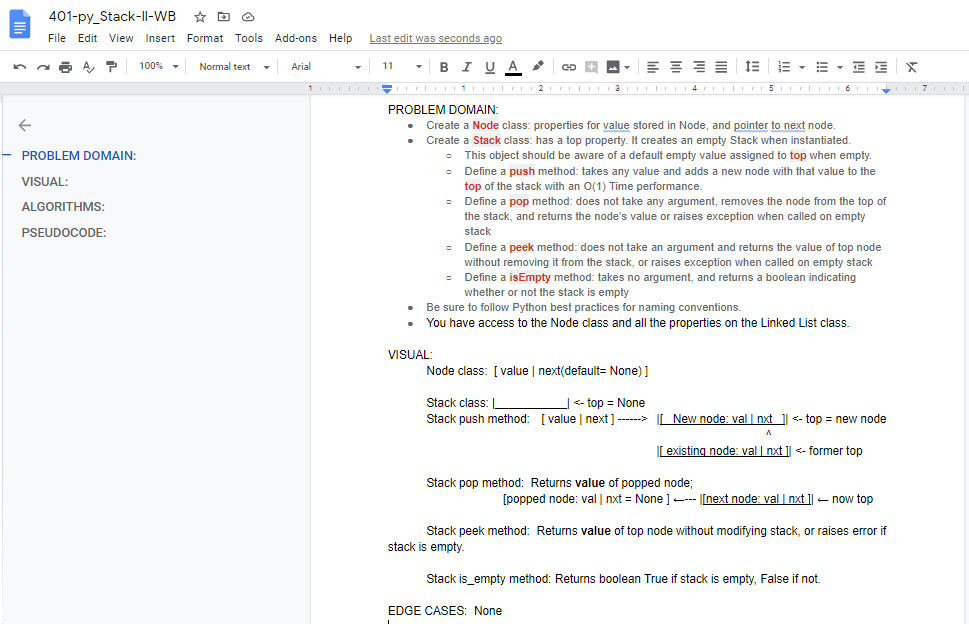
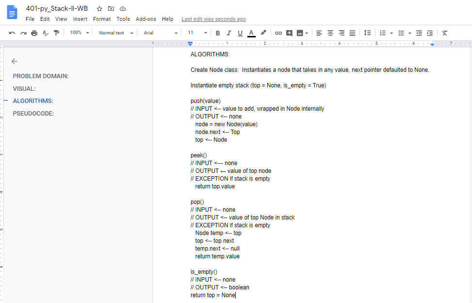
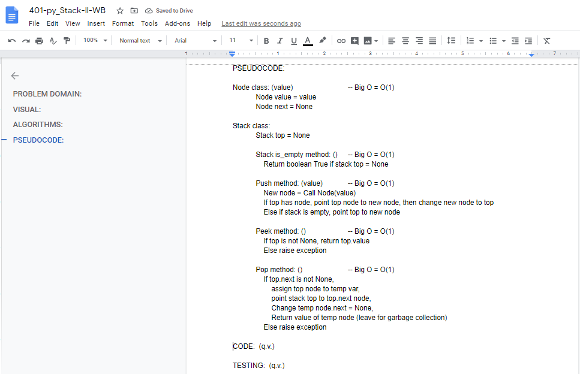
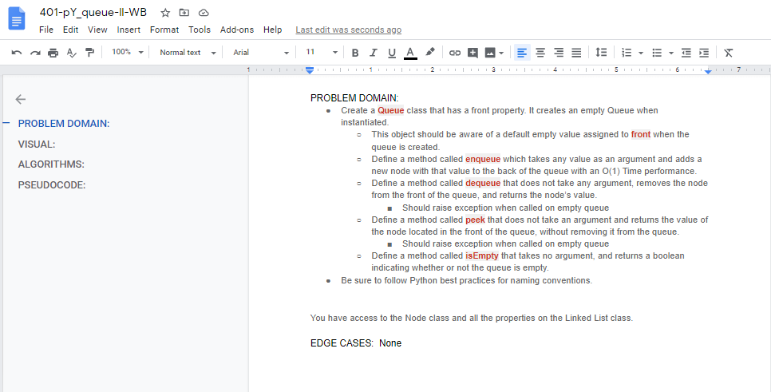
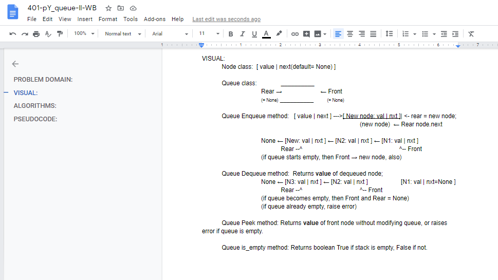
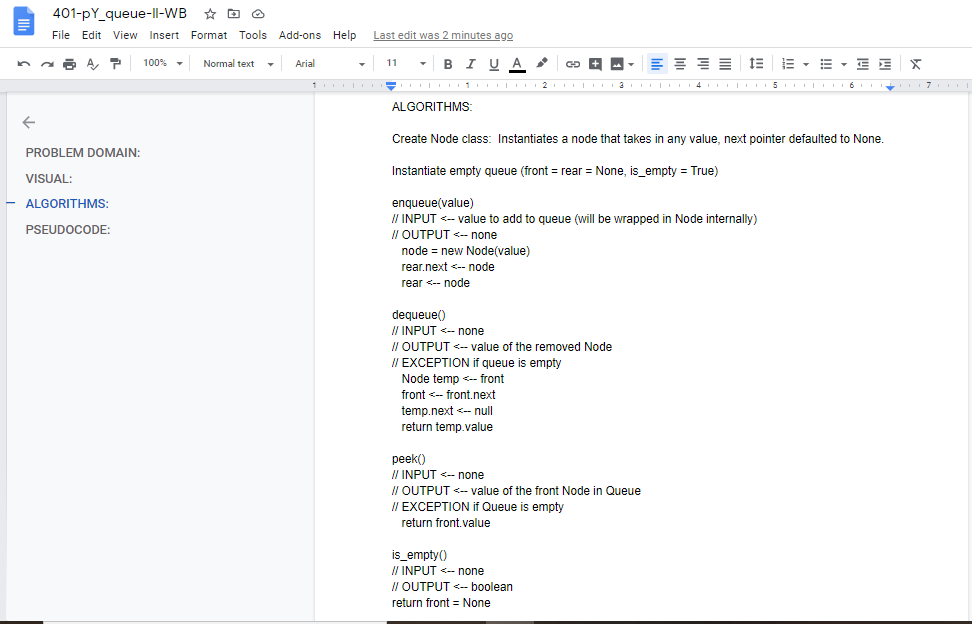
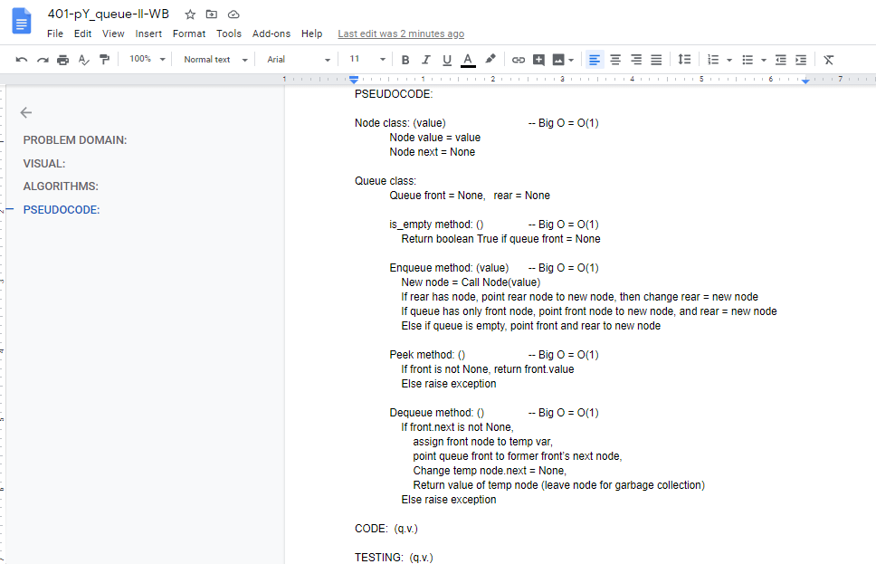

# Stacks and Queues
Implementation of a stack and a queue, each using linked list methods and a Node class.

## Challenge
#### Features
- Create a __`Node`__ class that has properties for the __value__ stored in the Node, and a pointer to the __next node__.
- Create a __`Stack`__ class that has a __top__ property. It creates an empty Stack when instantiated.
    - This object should be aware of a default empty value assigned to top when the stack is created.
    - Define a method called __`push`__ which takes any __value__ as an argument and adds a __new node__ with that value to the __top__ of the stack with an __*O(1) Time*__ performance.
    - Define a method called __`pop`__ that *does not* take any argument, __removes__ the node from the top of the stack, and __returns the node’s value__.
        - Should raise exception when called on empty stack
    - Define a method called __`peek`__ that *does not* take an argument and __returns the value of the node located on top__ of the stack, without removing it from the stack.
        - Should raise exception when called on empty stack
    - Define a method called __`isEmpty`__ that takes *no argument*, and __returns a boolean__ indicating whether or not the stack is empty.  

- Create a __`Queue`__ class that has a __`front`__ property. It creates an empty Queue when instantiated.
    - This object should be aware of a default empty value assigned to front when the queue is created.
    - Define a method called __`enqueue`__ which takes any __value__ as an argument and adds a __new node__ with that value to the back of the queue with an __*O(1) Time*__ performance.
    - Define a method called __`dequeue`__ that *does not* take any argument, __removes the node from the front__ of the queue, and __returns the node’s value__.
        - Should raise exception when called on empty queue
    - Define a method called __`peek`__ that *does not* take an argument and __returns the value of the node located in the front__ of the queue, __*without removing it from the queue*__.
        - Should raise exception when called on empty queue
    - Define a method called __`isEmpty`__ that takes *no argument*, and __returns a boolean__ indicating whether or not the queue is empty.  

- Be sure to follow your languages best practices for naming conventions.
- You have access to the __`Node`__ class and all the properties on the __`Linked List`__ class.

## Approach & Efficiency
Both Stack and Queue were implemented using a singly linked list methodology.  
__Big O space__ for each will be __O(n)__ and  
__Big O time__ for each operation is __O(1)__.

## API
This implementation has access to the Node class and all the properties on the Linked List class.

## Solution
My code is [here.](./stacks_and_queues.py)

## Code Challenge 10 whiteboards:
#### Stack - 

#### Queue - 

## Task Checklist:  
- [X] Top-level README “Table of Contents” is updated  
- [X] Feature tasks for this challenge are completed  
- [X] Unit tests written and passing  
    - [X] “Happy Path” - Expected outcome  
    - [X] Expected failure  
    - [X] Edge Case (if applicable/obvious)  
- [X] README for this challenge is complete  
    - [X] Summary, Description, Approach & Efficiency, Solution  
    - [X] Link to code  
    - [X] Pictures of whiteboards  
